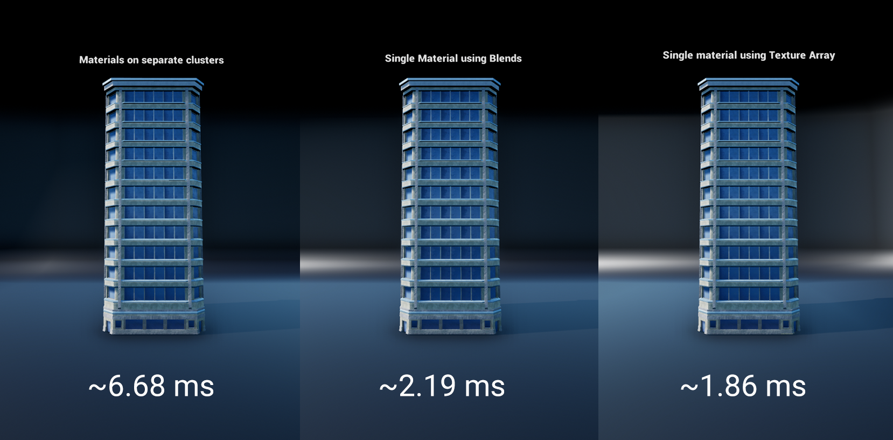
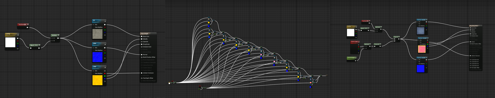
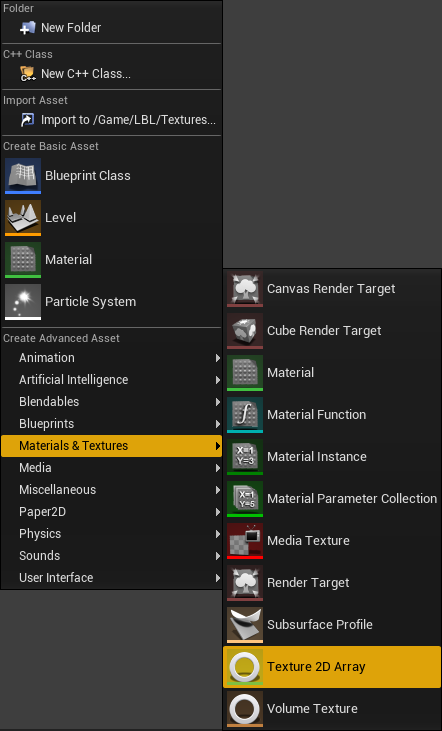
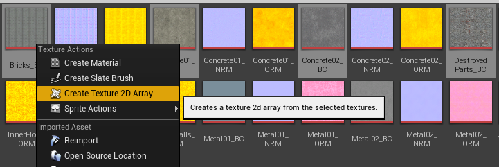
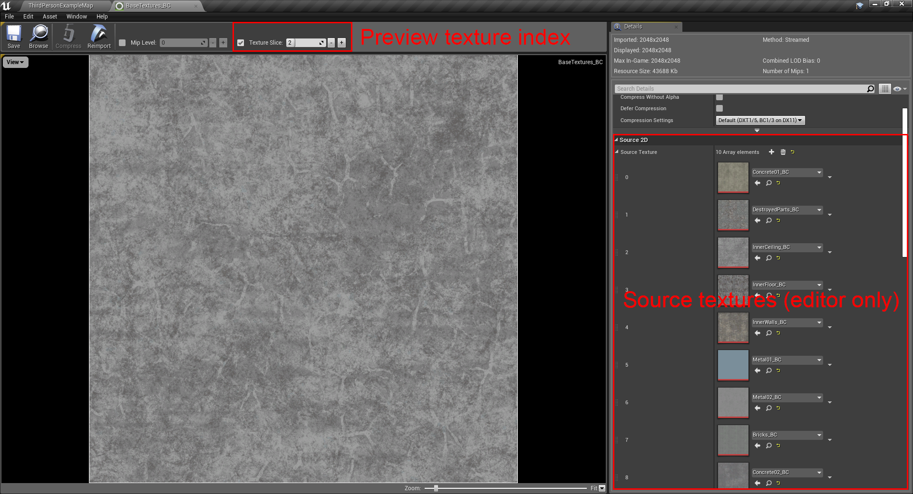
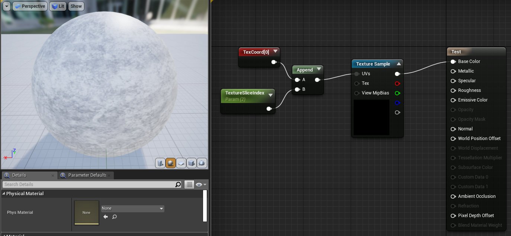
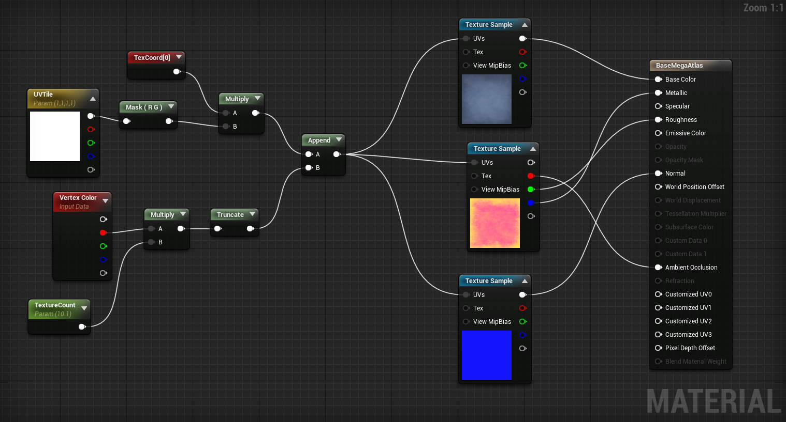
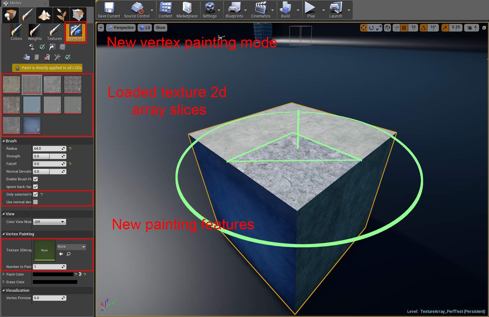
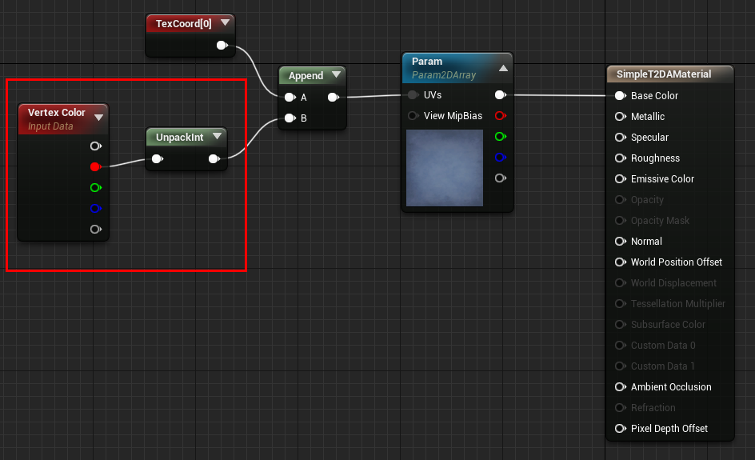

# UE4 Texture Arrays

## Disclaimer
Features in this engine modification are considered experimental and may be modified in future releases. It is not recommended to use them in production yet. Use this modification at your own risk.

## Overview

This engine modification adds support for Texture2D Array assets. This type of asset allows to create render resource that represents an array of textures. Unlike the widely used atlasing of the textures - Texture Arrays handle mip-mapping correctly, thus are not subject to Moire effect and doesn’t need any fixes of the UV space in the material. 

Our tests show that Texture Arrays are up to 15% faster for Base Pass rendering compared to a widely used texture Lerping technique (see video overview for details) and almost 3 times faster than drawing each material separately for each material cluster. Also managing materials with  Texture Arrays is far easier and keeps their node structure far less complex.


<p align="center">
  <a href="http://www.youtube.com/watch?feature=player_embedded&v=fuvDy4lvGOM
" target="_blank"></a></p>

<p align="center">
   <i> Video demonstration </i>
</p>


<p align="center">
   <i> Base Pass rendering time for 208 meshes using different content techniques. Left to right: 4 separate materials on clusters, single material utilizing Lerps to blend textures, single material utilizing Texture Arrays
 </i>
</p>


<p align="center">
   <i> Material node structure complexity. Left to right: simple base material, material utilizing Lerps to blend textures, material utilizing Texture Arrays
 </i>
</p>

## Getting Started

Just download UnrealEngine-4.21.2 folder from repository and move/replace its contents to your engine folder. You will also have to **recompile** your engine afterwards because Unreal Build Tool can incorrectly track changes of replaced files. 

### Prerequisites

You have to run you project on UE-4.21.2 compiled from sources. All prerequisites are the same as for running the usual engine. Merging with later versions of the engine was not tested, however may be possible. Please let us know about your experience in the comments. 

## Using Texture Array assets

### Creating Texture Arrays

There are two ways of creating Texture2D Array assets. You can create it using context menu and then fill Source Texture list inside Texture Array



You could also create Texture Array from  textures selected in Content Browser



### Preview Texture Array
You can view slices of Texture Array in Unreal texture viewer tool. 



### Sampling from Texture Array

To get texel from this resource you need to provide texture slice index along with UV.



### Painting meshes with Texture Arrays

In order to get your content pipeline on rails of using Texture Arrays you need to assemble material that is able of setting slice ID from Vertex Color. Here's an example of simple material that uses this approach:



Please notice that you need to set your TextureCount parameter to be:
```
(textureArrayLength) + (0.5/(textureArrayLength - 1))
```
Now you could use default Vertex Painting tools to paint your meshes. To select texture to paint with - just set a float value in Red channel as:
```
textureSliceID / (textureArrayLength - 1)
```
**Example:** Let's say you have a Texture Array with 10 slices in it and you want to paint with a 4th slice. Than you have to set your float painting value to be:
```
4 / (10-1) = 0.44
```
For an in-depth look please refer to material examples supplied with the sample project:
**Material'/Game/LBL/Materials/BaseMegaAtlas.BaseMegaAtlas'**

### Advanced vertex painting tools

We added special vertex painting mode that allows to encode integer number to vertex color. For current moment we use only red channel for saving vertex data.



This painting mode is designed to work with texture 2d arrays. When you select actor(s), painting tool searches for the first texture 2d array in all assigned materials, and shows these texture slices in painting toolbar. Selecting specific slice automatically updates painting color to match its number in Texture Array. 



We've added special material node UnpackInt that performs decoding of the index slice in new painting tools. Also, you can override auto loaded texture2d array with custom texture. It is useful if you have several texture arrays in material and you want to force a specific texture for tile preview. If you do not use texture array in materials, but you want to encode number in vertex color you can override slice ID in "Number To Paint" field.

### General Painting Tools Improvements

Global painting technique has several new features that designed to improve work:
 - Only selected triangle - this feature allows to paint only vertices of selected triangle. If it is enabled, current triangle will be highlighted. Brush Falloff doesn't have any effect when this mode is enabled.
 - Use normal deviation - this feature allows to select a bunch of triangles with the normal that have small deviation from base normal (the currently active triangle). You need to use "Normal Deviation" field to control amount of deviation. It is measured from -1 to 1 (-1 - all normals, 0 - 90 degrees deviation, 1 - means identical normals)

### Restrictions
- Texture Arrays are supported only in DX10/DX11.
- All textures in Texture Array must be of same dimensions
- All textures in Texture Array must use the same texture format

### Known issues

- Editor now freezes for a few seconds when adding/removing textures in the array
- Texture arrays should have “Pad To Power Of Two” set in properties. Will be fixed in future releases
- Built-in vertex painting tools are hard to use for painting objects. We will add auxiliaty painting tools in future releases

### Roadmap

- Auxiliary vertex painting tools
- Array of parameters (Float, vectors)
- Fix preview of texture arrays with different compression types (Normalmap, etc)
- Fix freezes when adding/removing textures from array
- Fix mip-maps not being generated unless “Pad To Power Of Two” is set

## Contributing

Please read [CONTRIBUTING.md](Documentation/CONTRIBUTING.md) for details on our code of conduct, and the process for submitting pull requests to us.

## Versioning

We use [SemVer](http://semver.org/) for versioning. For the versions available, see the [tags on this repository](https://github.com/fracturedbyte/UE4-MaterialBlending/tags). 

## Authors

* **Gleb Bulgakov** - *Initial coding* - [FracturedByte](https://github.com/BulgakovGleb)
* **Roman Leshchenko** - *Vision and workflow* - [FracturedByte](https://github.com/mazatracker)
* **Ruslan Smirnov** - *Example content* - [FracturedByte](https://github.com/fracturedbyte)

See also the list of [contributors](https://github.com/fracturedbyte/UE4-MaterialBlending/contributors) who participated in this project.

## Acknowledgments

* Many thanks for [PurpleBooth](https://gist.github.com/PurpleBooth/) for making templates of [CONTRIBUTION.md](https://gist.github.com/PurpleBooth/b24679402957c63ec426) and [README.md](https://gist.github.com/PurpleBooth/109311bb0361f32d87a2) that we've used for this repo
* Inspired by needs of UE4 developers


